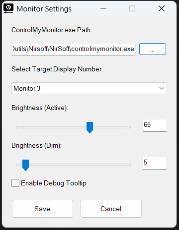

# AutoDimMonitor

Automates monitor brightness based on window activity.

When no windows are present on a specific screen, it dims to a preset level.

When a window is moved onto it, it restores full brightness.

## Features

- **Event-Driven:** Uses WinEventHooks (no stinky timers).
- **Portable:** Configurable via `.ini` file.
- **Lightweight:** Tiny footprint, runs in the background.
- **Blacklist:** Ignore specific windows (like overlays or system tools) that shouldn't trigger brightness.
- **Debug Mode:** On-screen overlay to see exactly which windows are being detected.

## Prerequisites

- [AutoHotkey v1.1+](https://www.autohotkey.com/)
- [ControlMyMonitor](https://www.nirsoft.net/utils/control_my_monitor.html) by NirSoft.

## Installation

1. **Download the latest version:** Get the `autoDimMonitor.zip` from the [Latest Release](https://github.com/FallenStar08/AutoDimMonitor/releases).
2. **Setup ControlMyMonitor:** Download `ControlMyMonitor.exe` from [NirSoft](https://www.nirsoft.net/utils/control_my_monitor.html) and note its file path.
3. **Extract:** Unzip the files into a folder of your choice.
4. **Run:** Launch `autoDimMonitor.ahk` (Requires AutoHotkey v1.1).
5. **Configure:** Right-click the tray icon and select **Settings** to set your monitor number and the path to `controlmymonitor.exe`.

## Settings Menu



## Configuration (`config.ini`)

```ini
[Settings]
; Path to ControlMyMonitor executable
PathToControl={pathToControlMyMonitor}\controlmymonitor.exe

; Brightness levels (0-100)
DimBrightness=5
BrightBrightness=65
Debug=0
Blacklist=Program Manager,NVIDIA Container
; The display number to monitor (e.g. 3 for display 3)
TargetDisplayNum=3
```

Icon made by <a href="https://www.flaticon.com/authors/design-circle" title="Design Circle">Design Circle</a> from <a href="https://www.flaticon.com/" title="Flaticon">www.flaticon.com</a>